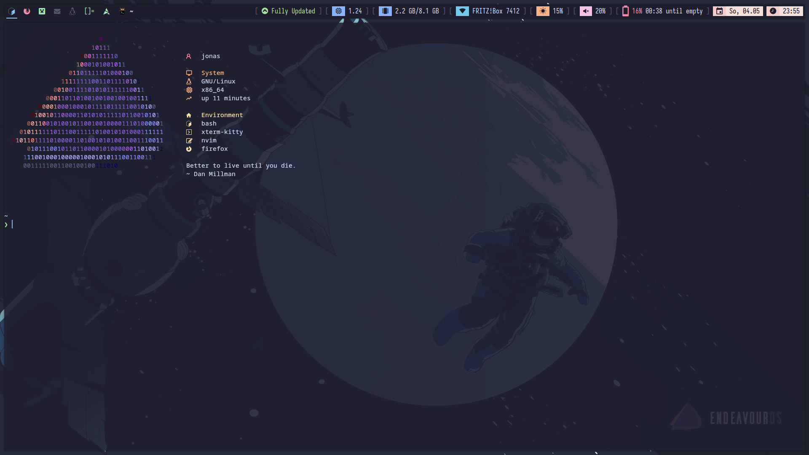
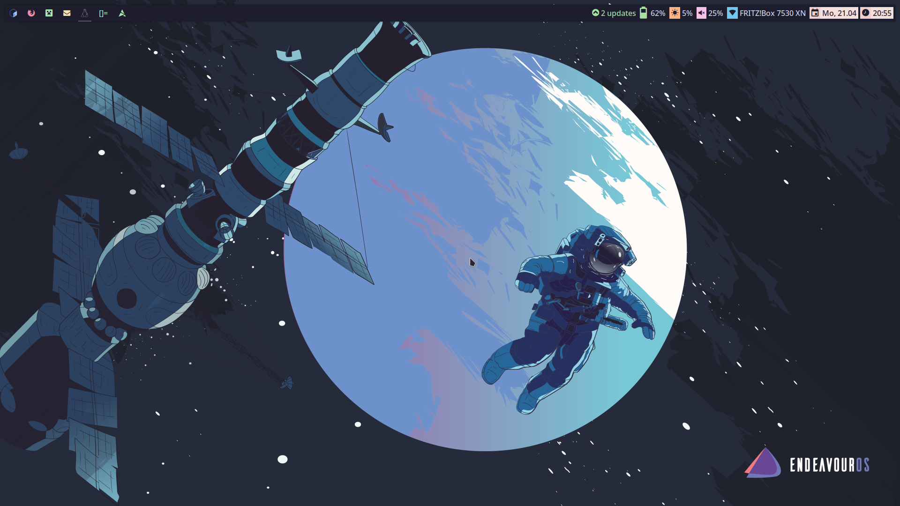
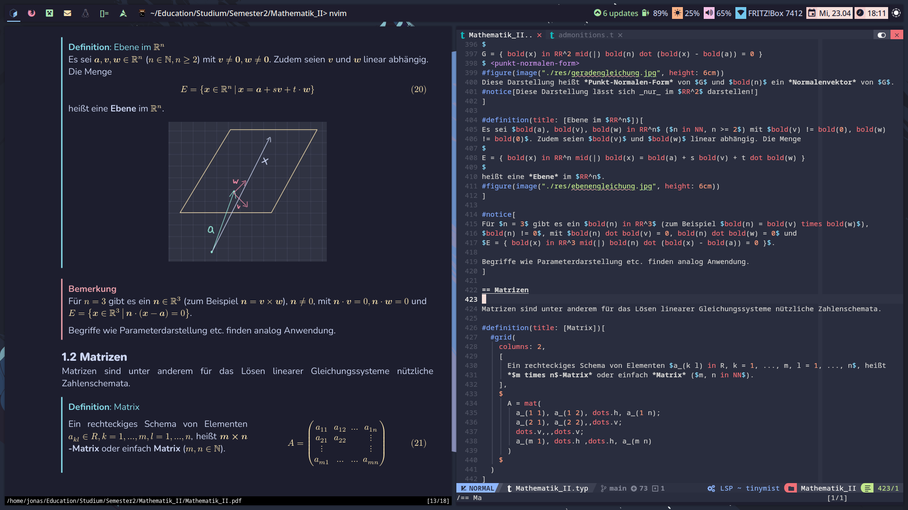

# dotfiles

## Requirements

- [Yolk][]

## Installation

> [!IMPORTANT]
> You might have to backup or remove some config directories before syncing
> them.

```nushell
git clone --recurse-submodules https://github.com/phoenixr-codes/dotfiles ~/.config/yolk;
mkdir ~/.config/nushell;
touch ~/.config/nushell/secrets.nu;
yolk safeguard;
yolk sync
```

## Sync

```console
yolk sync
```

## Preview

> [!NOTE]
> Some images are old and might not represent the latest configuration.







## TODO

- [ ] dwm bar hangs at some point.
- [ ] Rework dwm keybindings.
- [ ] Prevent config nu scripts to expose unneeded commands of scripts.
- [ ] Display error in dwm bar when bar script fails.
- [x] dwm bar hot reload capability.
- [x] Add `de_20` spell file `.spl` for neovim.
- [x] Add screenshots to README.
- [ ] Include umlauts in `nvim-cmp`.
- [x] Bitwarden in floating mode.
- [ ] Display weather on terminal launch.
- [ ] zenquotes support daily api endpoint.
- [x] Starship theme.
- [x] Make use of git submodules for themes provided by GitHub repositories for example.
- [x] Don't require Super key for function keys in dwm.
- [x] Move non-config and non-env stuff to a `init.nu` file which will be invoked by `config.nu`.
- [x] Log out when lock button is pressed `dm-tool switch-to-greeter`.
- [ ] The `x` alias does not expand paths (e.g. `x ~/foo`).
- [x] Fix issue with pkg updates in dwm bar.
- [ ] Bind fn keys.
- [x] Configure emoji selection apps and localsend to float in dwm.
- [x] Only include `config.h` of dwm.
- [ ] Add eww configurations.
- [ ] Fix eww font and gap issue.
- [ ] Fix font in dwm bar.
- [x] Apply different colors to panels on dwm bar (again).
- [x] Add audio level/muted to dwm bar.
- [x] Different battery icon depending on percentage.
- [x] Improve colors in dwm bar.
- [x] Remove CPU and memory from dwm bar.

[Yolk]: https://elkowar.github.io/yolk/

